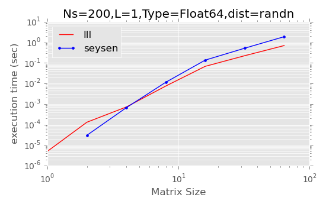
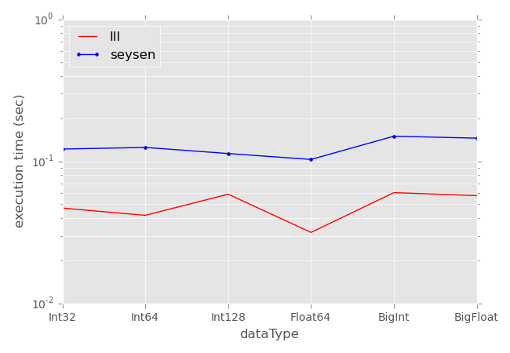

# LLLplus

[](https://travis-ci.org/christianpeel/LLLplus.jl)
[](http://pkg.julialang.org/?pkg=LLLplus&ver=release)

This package provides the following tools, which all operate on
floating-point lattices: Lenstra-Lenstra-Lovacsz (LLL) lattice
reduction, Seysen lattice reduction, a sphere decoder, and VBLAST
matrix decomposition. 

[LLL](https://en.wikipedia.org/wiki/Lenstra%E2%80%93Lenstra%E2%80%93Lov%C3%A1sz_lattice_basis_reduction_algorithm) [1]
lattice reduction is a powerful tool in computer science that is used
to cryptanalysis of public-key systems, to solve quadratic equations,
and to solve other linear problems such as in multi-terminal wireless.
The LLL is often used as a bounded-complexity approximate solution to
the
[shortest vector problem](https://en.wikipedia.org/wiki/Lattice_problem#Shortest_vector_problem_.28SVP.29)
(SVP).
Seysen [2] introduced a lattice reduction which focuses on global
optimization rather than local optimization as in LLL.

The
[closest vector problem](https://en.wikipedia.org/wiki/Lattice_problem#Closest_vector_problem_.28CVP.29)
(CVP) is related to the SVP; in the context of multi-antenna decoding
it is referred to as
[sphere-decoding](https://en.wikipedia.org/wiki/Lattice_problem#Sphere_decoding).

Finally, we include code to do a
[V-BLAST](https://en.wikipedia.org/wiki/Bell_Laboratories_Layered_Space-Time)
(Vertical-Bell Laboratories Layered Space-Time) matrix
decomposition. This decomposition is used in a detection algorithm [3] for
decoding spatially-multiplexed streams of data on multiple antennas or
other multi-terminal systems. V-BLAST is not as widely used outside of
the wireless communication community as lattice reduction and CVP
techniques such as the sphere decoder.

### Examples

Here are a few examples of using the functions in the
package on random lattices.

```julia
Pkg.add("LLLplus")
using LLLplus

# Time LLL, VBLAST decomposition of a complex matrix with randn entries 
N = 1000;
H = randn(N,N) + im*randn(N,N);
println("Testing LLL on $(N)x$(N) complex matrix...")
@time (B,T,Q,R) = lll(H);
M = 200;
println("Testing VBLAST on $(M)x$(M) chunk of same matrix...")
@time (W,P,B) = vblast(H[1:M,1:M]);

# Time LLL, Seysen decompositions of a 100x100 Int128 matrix with
# rand entries distributed uniformly between -100:100
N = 100;
H = zeros(Int64, N,N);
rand!(-100:100, H);
println("Testing LLL on $(N)x$(N) real matrix...")
@time (B,T,Q,R) = lll(H);
println("Testing Seysen on same $(N)x$(N) matrix...")
@time (B,T) = seysen(H);
```

### Execution Time results

On this page we give a few performance results from tests run on
Travis-CI during normal CI tests. In the tests we time execution of the
lattice-reduction functions, average the results over multiple random
matrices, and show results as a function of the size of the matrix and
of the data type. 

We first show how the time varies with matrix size (1,2,4,...64); the
vertical axis shows execution time on a logarithmic scale; the x-axis
is also logarithmic. The generally linear nature of the LLL curve supports
the polynomial-time nature of the algorithm. Each data point
is the average of execution time of 200 runs of a lattice-reduction
technique, where the matrices used were generated using *randn* to
emulate unit-variance Gaussian-distributed values.


In the horizontal axis of the next figure, the values 1..6 represent
Int32, Int64, Int128, Float64, BitInt, and BigFloat datatypes which
are used to generate 200 16x16 matrices, over which execution time for
the lattic reduction techniques is averaged.  The vertical axis is a
logarithmic representation of execution time as in the previous
figure. 

### Future work

These tools were developed and tested in the context of multi-antenna
wireless communication, and do not reflect the state-of-the art
lattice tools used for cryptography [4]. Adding such tools and the
following improvements are among changes which can be made:
* Add Block-Korkin-Zolotarev lattice redution, with improvements
  as in [4], and Brun lattice reduction 
* The [SVP](http://www.latticechallenge.org/svp-challenge/) Challenge
  and the
  [Ideal](http://www.latticechallenge.org/ideallattice-challenge/)
  Lattice challenge have code to generate lattices for the respective
  contests which could be used or duplicated to make challenging
  tests. The main [Lattice](http://www.latticechallenge.org/)
  Challenge also lists references which could be used to replicate
  tests.
* Compare with the [Number Theory Library](http://www.shoup.net/ntl/).
* Utilize BLAS functions for faster vector-matrix operations, or just
  devectorize the functions (at present they are not much faster than
  the corresponding Matlab functions).


### References

[1] Lenstra, A. K.; Lenstra, H. W., Jr.; Lovász, L. (1982). "Factoring
polynomials with rational coefficients". Mathematische Annalen 261
(4): 515–534.

[2] M. Seysen,
["Simultaneous reduction of a lattice basis and its reciprocal basis"]
(http://link.springer.com/article/10.1007%2FBF01202355) Combinatorica,
Vol 13, no 3, pp 363-376, 1993.

[3] P. W. Wolniansky, G. J. Foschini, G. D. Golden, R. A. Valenzuela
(September 1998). ["V-BLAST: An Architecture for Realizing Very High
Data Rates Over the Rich-Scattering Wireless Channel"]
(http://ieeexplore.ieee.org/xpl/login.jsp?tp=&arnumber=738086). Proc. URSI
ISSSE: 295–300. 

[4] Y. Chen, P. Q. Nguyen (2011) ["BKZ 2.0: Better Lattice Security Estimates"]
(http://www.iacr.org/archive/asiacrypt2011/70730001/70730001.pdf).
Proc. ASIACRYPT 2011.

### Author

This module was written by
[Chris Peel](https://github.com/ChristianPeel).


