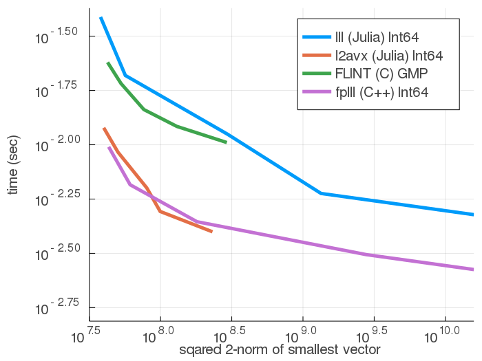

# LLLplus.jl

[](https://travis-ci.org/christianpeel/LLLplus.jl)
[](https://pkg.julialang.org/docs/LLLplus/)

LLLplus includes
[Lenstra-Lenstra-Lovász](https://en.wikipedia.org/wiki/Lenstra%E2%80%93Lenstra%E2%80%93Lov%C3%A1sz_lattice_basis_reduction_algorithm)
(LLL), [Brun](https://en.wikipedia.org/wiki/Viggo_Brun), and Seysen lattice reduction; and [shortest vector problem](https://en.wikipedia.org/wiki/Lattice_problem#Shortest_vector_problem_.28SVP.29)
(SVP) and
[closest vector problem](https://en.wikipedia.org/wiki/Lattice_problem#Closest_vector_problem_.28CVP.29)
(CVP) solvers. These lattice reduction and related lattice tools are
used in cryptography, digital communication, and integer programming.
The historical and practical prominence of the LLL technique in
lattice tools is the reason for its use in the name "LLLplus".
This package is experimental; see
[fplll](https://github.com/fplll/fplll) for a robust tool.

LLL [1] lattice reduction is a powerful tool that is widely used in
cryptanalysis, in cryptographic system design, in digital
communications, and to solve other integer problems.  LLL reduction is
often used as an approximate solution to the SVP.
We also include Gauss/Lagrange, Brun [2] and Seysen [3]
lattice reduction techniques. The LLL, Brun, and Seysen algorithms are
based on [4]. The CVP solver is based on [5] and can handle lattices
and bounded integer constellations. A slow SVP solver based on the CVP
tool is included as well.

We also include code to do a
[Vertical-Bell Laboratories Layered Space-Time](https://en.wikipedia.org/wiki/Bell_Laboratories_Layered_Space-Time)
(V-BLAST) [6] matrix decomposition which is used in digital
communications. The CVP, LLL, Brun, Seysen, and V-BLAST functions can
be used to solve (exactly or approximately) CVP problems; the
[MUMIMO.jl](https://github.com/christianpeel/MUMIMO.jl) package
demostrates how these functions can be used in decoding
multi-antenna signals.

Another important application is in cryptanalysis; as an demo of a
cryptanalytic attack, see the `subsetsum` function.  The LLL algorithm has
been shown to solve many integer programming feasibility problems; see
`integerfeasibility` for a demo. Lattice tools are often used to study and solve
Diophantine problems; for example in  "simultaneous diophantine
approximation" a vector of real numbers are approximated by rationals
with a common deonminator. For a demo function, see `rationalapprox`.
Finally, to see how the LLL can be used to find spigot formulas for
irrationals, see `spigotBBP`.

### Examples

Each function contains documentation and examples available via Julia's
built-in documentation system, for example with `?lll`. Documentation
for all functions is available on
[pkg.julialang.org](https://pkg.julialang.org/docs/LLLplus/). A tutorial notebook is
found in the [`docs`](docs/LLLplusTutorial.ipynb) directory or on
[nbviewer](https://nbviewer.jupyter.org/github/christianpeel/LLLplus.jl/blob/master/docs/LLLplusTutorial.ipynb).

Here are a few examples of using the functions in the
package on random lattices.

```julia
Pkg.add("LLLplus")
using LLLplus
# repeat the commands below to remove JIT compile time

# Time the decomposition of a matrix with randn entries
N = 100;
H = randn(N,N);
@time B,T = sizereduction(H);
@time B,T = brun(H);
@time B,T = lll(H);
@time B,T = seysen(H);
@time W,P,B = vblast(H);

# check out the CVP solver
@time Q,R=qr(H);
u=Int.(rand(0:1e10,N));
y=H*u+rand(N)/100;
@time uhat=cvp(Q'*y,R);
sum(abs.(u-uhat))
```

### Execution Time results

In the first test we compare the `lll` function from LLLplus, the
`l2avx` function in the `src\l2.jl` file in LLLplus, the
`lll_with_transform` function from Nemo (which uses FLINT), and the
`lll_reduction` function from fplll. Nemo and fplll are written by
number theorists and are good benchmarks against which to compare.  We
first show how the execution time varies as the basis (matrix) size
varies over [4 8 16 32 64]. For each matrix size, 20 random bases
are generated using fplll's `gen_qary` function with depth of 25
bits, with the average execution time shown; the `eltype` is `Int64`
except for NEMO, which uses GMP (its own `BigInt`); in all cases the
`δ=.99`. The vertical axis shows
execution time on a logarithmic scale; the x-axis is also
logarithmic. The generally linear nature of the LLL curves supports
the polynomial-time nature of the algorithm. The `LLLplus.lll`
function is slower, while `l2avx` is similar to fplll. Though not
shown, using bases from `gen_qary` with bit depth of 45 gives fplll
a larger advantage. This figure was generated using code in
`test/timeLLLs.jl`.


One question that could arise when looking at the plot above is what
the quality of the basis is. In the next plot we show execution time
vs the norm of the first vector in the reduced basis, this first
vector is typically the smallest; its norm is an rough indication of
the quality of the reduced basis. We show results averaged over 20
random bases from `gen_qary` with depth `25` bits, this time with the
dimension fixed at `32`. The curve is created by varying the `δ`
parameter from `.29` to `.99` in steps of `.2`; the larger times and
smaller norms correspond to the largest `δ` values. Though the `l2avx`
function is competitive with fplll in this case, in many other cases
the fplll code is significantly faster.



Finally, we show execution time for several built-in
datatypes (Int32, Int64, Int128, Float32, Float64, BitInt, and
BigFloat) as well as type from external packages (Float128 from
Quadmath.jl and Double64 from DoubleFloat.jl) which are used to
generate 40 128x128 matrices, over which execution time for the
lattice reduction techniques is averaged.  The vertical axis is a
logarithmic representation of execution time as in the previous
figure. This figure was generated using code in `test/perftest.jl`.


### Notes

There are certainly many improvements and additions that could be made
to LLLplus, such as adding Block-Korkin-Zolotarev (BKZ) lattice reduction
with improvements as in [8]. Even so, it would be hard to compete with
[fplll](https://github.com/fplll/fplll) on features. In fact, a Julia
wrapper around [fplll](https://github.com/fplll/fplll) would be the most
useful addition to lattice tools in Julia; it would
provide funcionality not in LLLplus such as BKZ reduction.

The algorithm pseudocode in the monograph [7] and the survey paper [4]
were very helpful in writing the lattice reduction tools in LLLplus
and are a good resource for further study. If you are trying to break
one of the [Lattice Challenge](http://www.latticechallenge.org)
records or are looking for robust, well-proven lattice tools, look at
[fplll](https://github.com/fplll/fplll). Also, for many
number-theoretic problems the
[Nemo.jl](https://github.com/Nemocas/Nemo.jl) package is appropriate;
it uses the [FLINT](http://flintlib.org/) C library to do LLL
reduction on Nemo-specific data types.  Finally, no number theorists
have worked on LLLplus; please treat the package as experimental.

### References

[1] A. K. Lenstra; H. W. Lenstra Jr.; L. Lovász, ["Factoring polynomials with rational coefficients"](http://ftp.cs.elte.hu/~lovasz/scans/lll.pdf). Mathematische Annalen 261, 1982.

[2] V. Brun,
["En generalisation av kjedebrøken I,"](https://archive.org/stream/skrifterutgitavv201chri#page/300/mode/2up)
Skr. Vidensk. Selsk. Kristiana, Mat. Nat. Klasse, 1919.

[3] M. Seysen, ["Simultaneous reduction of a lattice basis and its reciprocal basis"](http://link.springer.com/article/10.1007%2FBF01202355) Combinatorica, 1993.

[4] D. Wuebben, D. Seethaler, J. Jalden, and G. Matz, ["Lattice Reduction - A Survey with Applications in Wireless Communications"](http://www.ant.uni-bremen.de/sixcms/media.php/102/10740/SPM_2011_Wuebben.pdf). IEEE Signal Processing Magazine, 2011.

[5] A. Ghasemmehdi, E. Agrell, ["Faster Recursions in Sphere Decoding"](https://publications.lib.chalmers.se/records/fulltext/local_141586.pdf) IEEE
Transactions on Information Theory, vol 57, issue 6 , June 2011.

[6] P. W. Wolniansky, G. J. Foschini, G. D. Golden, R. A. Valenzuela, ["V-BLAST: An Architecture for Realizing Very High Data Rates Over the Rich-Scattering Wireless Channel"](http://ieeexplore.ieee.org/xpl/login.jsp?tp=&arnumber=738086). Proc. URSI
ISSSE: 295–300, 1998. 

[7] M. R. Bremner, ["Lattice Basis Reduction: An Introduction to the LLL
 Algorithm and Its Applications"](https://www.amazon.com/Lattice-Basis-Reduction-Introduction-Applications/dp/1439807027) CRC Press, 2012.

[8] Y. Chen, P. Q. Nguyen, ["BKZ 2.0: Better Lattice Security Estimates"](http://www.iacr.org/archive/asiacrypt2011/70730001/70730001.pdf). Proc. ASIACRYPT 2011.
