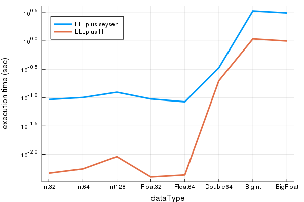

# LLLplus.jl

[](https://travis-ci.org/christianpeel/LLLplus.jl)
<!---
[](http://pkg.julialang.org/?pkg=LLLplus&ver=0.7)
-->

Lattice reduction and related lattice tools are used in 
cryptography, digital communication, and integer programming.  LLLplus
includes Lenstra-Lenstra-Lovacsz (LLL) lattice reduction, Seysen
lattice reduction, VBLAST matrix decomposition, and a closest vector
problem (CVP) solver.

[LLL](https://en.wikipedia.org/wiki/Lenstra%E2%80%93Lenstra%E2%80%93Lov%C3%A1sz_lattice_basis_reduction_algorithm)
[1] lattice reduction is a powerful tool that is widely used in
cryptanalysis, in cryptographic system design, in digital
communications, and to solve other integer problems.  LLL reduction is
often used as an approximate solution to the
[shortest vector problem](https://en.wikipedia.org/wiki/Lattice_problem#Shortest_vector_problem_.28SVP.29)
(SVP).  We also include Gauss/Lagrange 2-dimensional lattice reduction
as a learning tool, and Seysen [2] lattice reduction which
simultaneously reduces a basis `B` and its dual `inv(B)'`. The LLL and
Seysen algorithms are based on [3]. The
[CVP](https://en.wikipedia.org/wiki/Lattice_problem#Closest_vector_problem_.28CVP.29)
solver is based on [4] and can handle lattices and bounded integer
constellations.
<!-- Many GPS researchers refer to the CVP as the "integer least squares" -->
<!-- problem, while digital communication researchers often call it the -->
<!-- [sphere-decoder](https://en.wikipedia.org/wiki/Lattice_problem#Sphere_decoding). -->

We also include code to do a
[Vertical-Bell Laboratories Layered Space-Time](https://en.wikipedia.org/wiki/Bell_Laboratories_Layered_Space-Time)
(V-BLAST) [5] matrix decomposition which is used in digital
communications. The LLL,
Seysen, V-BLAST, and CVP functions are used to solve (exactly or
approximately) CVP problems in encoding and decoding multi-terminal
signals.

### Examples

Here are a few examples of using the functions in the
package on random lattices.

```julia
Pkg.add("LLLplus")
using LLLplus

# Time LLL, VBLAST decomposition of a complex matrix with randn entries 
N = 1000;
H = randn(N,N) + im*randn(N,N);
println("Testing LLL on $(N)x$(N) complex matrix...")
@time B,T,Q,R = lll(H);
M = 200;
println("Testing VBLAST on $(M)x$(M) chunk of same matrix...")
@time W,P,B = vblast(H[1:M,1:M]);

# Time LLL, Seysen decompositions of a 100x100 Int64 matrix with
# rand entries distributed uniformly between -100:100
N = 100;
H = rand(-100:100,N,N);
println("Testing LLL on $(N)x$(N) real matrix...")
@time B,T,Q,R = lll(H);
println("Testing Seysen on same $(N)x$(N) matrix...")
@time B,T = seysen(H);
```

### Execution Time results

On this page we give a few performance results obtained from the
following command in the top-level LLLplus directory:
`julia -e 'include("benchmark/perftest.jl")'`
In the tests we time execution of the lattice-reduction functions,
average the results over multiple random matrices, and show results as
a function of the size of the matrix and of the data type. 

We first show how the time varies with matrix size (1,2,4,...256); the
vertical axis shows execution time on a logarithmic scale; the x-axis
is also logarithmic. The generally linear nature of the LLL curve supports
the polynomial-time nature of the algorithm. Each data point
is the average of execution time of 40 runs of a lattice-reduction
technique, where the matrices used were generated using 'randn' to
emulate unit-variance Gaussian-distributed values.


Though the focus of the package is on floating-point, 
all the modules can handle a variety of data types. In the next figure
we show execution time for several datatypes (Int32, Int64,
Int128, Float32, Float64, DoublFloat, BitInt, and BigFloat) which are used to
generate 40 128x128 matrices, over which execution time for the lattice
reduction techniques is averaged.  The vertical axis is a logarithmic
representation of execution time as in the previous
figure.



The algorithm pseudocode in the monograph [6] and the survey paper [3]
were very helpful in writing the lattice reduction tools in LLLplus
and are a good resource for further study.

LLLplus does not pretend to be a tool for number-theory work. For
that, see the [Nemo.jl](https://github.com/wbhart/Nemo.jl) package
which uses the [FLINT](http://flintlib.org/) C library to do LLL
reduction on Nemo-specific data types.

### Future

Possible improvements include:
* Add Block-Korkin-Zolotarev lattice redution, with improvements
  as in [7], code for Babai's simple CVP approximation [8], and
  Brun's integer relation decomposition.
* The [SVP](http://www.latticechallenge.org/svp-challenge/) Challenge
  and the
  [Ideal](http://www.latticechallenge.org/ideallattice-challenge/)
  Lattice challenge have code to generate lattices for the respective
  contests which could be used or duplicated to make challenging
  performance tests. The main
  [Lattice](http://www.latticechallenge.org/) Challenge also lists
  references which could be used to replicate tests.
* Compare with the [fplll](https://github.com/fplll/fplll) library,
  the [Number Theory Library](http://www.shoup.net/ntl/), and
  NEMO/FLINT. 
<!-- * Make additions to -->
<!--   [ArbFloats](https://github.com/JuliaArbTypes/ArbFloats.jl) and -->
<!--   [IntervalArithmetic](https://github.com/eeshan9815/IntervalArithmetic.jl) -->
<!--   to enable them to work. -->

### References

[1] A. K. Lenstra; H. W. Lenstra Jr.; L. Lovász, ["Factoring polynomials with rational coefficients"](http://ftp.cs.elte.hu/~lovasz/scans/lll.pdf). Mathematische Annalen 261, 1982

[2] M. Seysen, ["Simultaneous reduction of a lattice basis and its reciprocal basis"](http://link.springer.com/article/10.1007%2FBF01202355) Combinatorica, 1993.

[3] D. Wuebben, D. Seethaler, J. Jalden, and G. Matz, ["Lattice Reduction - A Survey with Applications in Wireless Communications"](http://www.ant.uni-bremen.de/sixcms/media.php/102/10740/SPM_2011_Wuebben.pdf). IEEE Signal Processing Magazine, 2011.

[4] A. Ghasemmehdi, E. Agrell, ["Faster Recursions in Sphere Decoding"](https://publications.lib.chalmers.se/records/fulltext/local_141586.pdf) IEEE
Transactions on Information Theory, vol 57, issue 6 , June 2011.

[5] P. W. Wolniansky, G. J. Foschini, G. D. Golden, R. A. Valenzuela, ["V-BLAST: An Architecture for Realizing Very High Data Rates Over the Rich-Scattering Wireless Channel"](http://ieeexplore.ieee.org/xpl/login.jsp?tp=&arnumber=738086). Proc. URSI
ISSSE: 295–300, 1998. 

[6] M. R. Bremner, ["Lattice Basis Reduction: An Introduction to the LLL
 Algorithm and Its Applications"](https://www.amazon.com/Lattice-Basis-Reduction-Introduction-Applications/dp/1439807027) CRC Press, 2012.

[7] Y. Chen, P. Q. Nguyen, ["BKZ 2.0: Better Lattice Security Estimates"](http://www.iacr.org/archive/asiacrypt2011/70730001/70730001.pdf). Proc. ASIACRYPT 2011.

[8] L. Babai, ["On Lovász’ lattice reduction and the nearest lattice point problem"](https://link.springer.com/article/10.1007/BF02579403),
Combinatorica, 1986.

