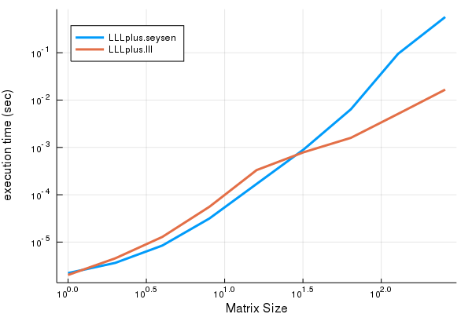
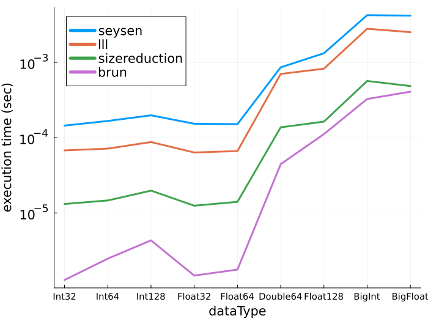

## LLLplus README

```@meta
CurrentModule = LLLplus
```

Lattice reduction and related lattice tools are used in 
cryptography, digital communication, and integer programming.  LLLplus
includes Lenstra-Lenstra-Lovász (LLL), Brun,
and Seysen lattice reduction; VBLAST matrix decomposition; and a closest vector
problem (CVP) solver. The historical and practical prominence of the
LLL technique in lattice tools is the reason for its use in the
name "LLLplus".

[LLL](https://en.wikipedia.org/wiki/Lenstra%E2%80%93Lenstra%E2%80%93Lov%C3%A1sz_lattice_basis_reduction_algorithm)
[1] lattice reduction is a powerful tool that is widely used in
cryptanalysis, in cryptographic system design, in digital
communications, and to solve other integer problems.  LLL reduction is
often used as an approximate solution to the
[shortest vector problem](https://en.wikipedia.org/wiki/Lattice_problem#Shortest_vector_problem_.28SVP.29)
(SVP).  We also include Gauss/Lagrange, Brun [2] and Seysen [3]
lattice reduction techniques. The LLL, Brun, and
Seysen algorithms are based on [4]. The
[CVP](https://en.wikipedia.org/wiki/Lattice_problem#Closest_vector_problem_.28CVP.29)
solver is based on [5] and can handle lattices and bounded integer
constellations.

We also include code to do a
[Vertical-Bell Laboratories Layered Space-Time](https://en.wikipedia.org/wiki/Bell_Laboratories_Layered_Space-Time)
(V-BLAST) [6] matrix decomposition which is used in digital
communications. The LLL, Brun, Seysen, V-BLAST, and CVP functions are
used to solve (exactly or approximately) CVP problems in encoding and
decoding multi-terminal signals.

Another important application of is in cryptanalysis: attacking the
security of security systems. As an example of the sort of tools that
are used in cryptanalysis, see the `subsetsum`
function.  Another important application is in integer programming,
where the LLL algorithm has been shown to solve the integer
programming feasibility problem; see `integerfeasibility`.

### Examples

Each function contains documentation and examples available via the
built-in documentation system, for example with `?lll`. Documentation
of all the functions are available by searching for "LLLplus.jl" at
[pkg.julialang.org](https://pkg.julialang.org). A tutorial
[notebook](https://github.com/christianpeel/LLLplus.jl/docs/LLLplusTutorial.ipynb) is found in the `docs` directory.

Here are a few examples of using the functions in the
package on random lattices.

```julia
Pkg.add("LLLplus")
using LLLplus

# Time LLL, VBLAST decomposition of a complex matrix with randn entries
N = 200;
H = randn(N,N) + im*randn(N,N);
@time B,T = lll(H);
@time B,T = lll(H);
@time W,P,B = vblast(H);
@time W,P,B = vblast(H);

# Time LLL, Seysen decompositions of a 100x100 Int64 matrix with
# entries distributed uniformly between -100:100
N = 100;
H = rand(-100:100,N,N);
@time B,T = sizereduction(H);
@time B,T = sizereduction(H);
@time B,T = brun(H);
@time B,T = brun(H);
@time B,T = lll(H);
@time B,T = lll(H);
@time B,T = seysen(H);
@time B,T = seysen(H);
```

### Execution Time results

The following performance results are obtained from the
following command in the top-level LLLplus directory:
`julia -e 'include("benchmark/perftest.jl")'`
In the tests we time execution of the lattice-reduction functions,
average the results over multiple random matrices, and show results as
a function of the size of the matrix and of the data type. 

We first show how the time varies with matrix size (1,2,4,...256); the
vertical axis shows execution time on a logarithmic scale; the x-axis
is also logarithmic. The generally linear nature of the LLL curve supports
the polynomial-time nature of the algorithm. Each data point
is the average of execution time of 40 runs of a lattice-reduction
technique, where the matrices used were generated using 'randn' to
emulate unit-variance Gaussian-distributed values.



Though the focus of the package is on floating-point,
all the modules can handle a variety of data types. In the next figure
we show execution time for several datatypes (Int32, Int64,
Int128, Float32, Float64, DoubleFloat, BitInt, and BigFloat) which are used to
generate 40 128x128 matrices, over which execution time for the lattice
reduction techniques is averaged.  The vertical axis is a logarithmic
representation of execution time as in the previous
figure.



The algorithm pseudocode in the monograph [7] and the survey paper [4]
were very helpful in writing the lattice reduction tools in LLLplus
and are a good resource for further study. If you are trying to break
one of the [Lattice Challenge](http://www.latticechallenge.org)
records or are looking for robust, well-proven lattice tools, look at
[fplll](https://github.com/fplll/fplll). Also, for many
number-theoretic problems the
[Nemo.jl](https://github.com/wbhart/Nemo.jl) package is appropriate;
it uses the [FLINT](http://flintlib.org/) C library to do LLL
reduction on Nemo-specific data types.
Finally, LLLplus should have version number of about 0.2.0 rather
than 1.2.0; please treat the package as experimental.

### Future

Possible improvements to LLLplus include:
* A Julia wrapper around the [fplll](https://github.com/fplll/fplll)
  or [Number Theory Library](http://www.shoup.net/ntl/). These
  respected tools could be used directly and would provide
  funcionality not in LLLplus. A wrapper around one or both of these
  tools would be the most useful addition to lattice tools in Julia.
* Add Block-Korkin-Zolotarev lattice reduction, with improvements
  as in [8], and explicit CVP approximations using LLL, Brun, Seysen,
  and VBLAST. 
* More examples of applications to encourage and motivate users.

### References

[1] A. K. Lenstra; H. W. Lenstra Jr.; L. Lovász, ["Factoring polynomials with rational coefficients"](http://ftp.cs.elte.hu/~lovasz/scans/lll.pdf). Mathematische Annalen 261, 1982.

[2] V. Brun,
["En generalisation av kjedebrøken I,"](https://archive.org/stream/skrifterutgitavv201chri#page/300/mode/2up)
Skr. Vidensk. Selsk. Kristiana, Mat. Nat. Klasse, 1919.

[3] M. Seysen, ["Simultaneous reduction of a lattice basis and its reciprocal basis"](http://link.springer.com/article/10.1007%2FBF01202355) Combinatorica, 1993.

[4] D. Wuebben, D. Seethaler, J. Jalden, and G. Matz, ["Lattice Reduction - A Survey with Applications in Wireless Communications"](http://www.ant.uni-bremen.de/sixcms/media.php/102/10740/SPM_2011_Wuebben.pdf). IEEE Signal Processing Magazine, 2011.

[5] A. Ghasemmehdi, E. Agrell, ["Faster Recursions in Sphere Decoding"](https://publications.lib.chalmers.se/records/fulltext/local_141586.pdf) IEEE
Transactions on Information Theory, vol 57, issue 6 , June 2011.

[6] P. W. Wolniansky, G. J. Foschini, G. D. Golden, R. A. Valenzuela, ["V-BLAST: An Architecture for Realizing Very High Data Rates Over the Rich-Scattering Wireless Channel"](http://ieeexplore.ieee.org/xpl/login.jsp?tp=&arnumber=738086). Proc. URSI
ISSSE: 295–300, 1998. 

[7] M. R. Bremner, ["Lattice Basis Reduction: An Introduction to the LLL
 Algorithm and Its Applications"](https://www.amazon.com/Lattice-Basis-Reduction-Introduction-Applications/dp/1439807027) CRC Press, 2012.

[8] Y. Chen, P. Q. Nguyen, ["BKZ 2.0: Better Lattice Security Estimates"](http://www.iacr.org/archive/asiacrypt2011/70730001/70730001.pdf). Proc. ASIACRYPT 2011.


## List of Functions
```@index
```
